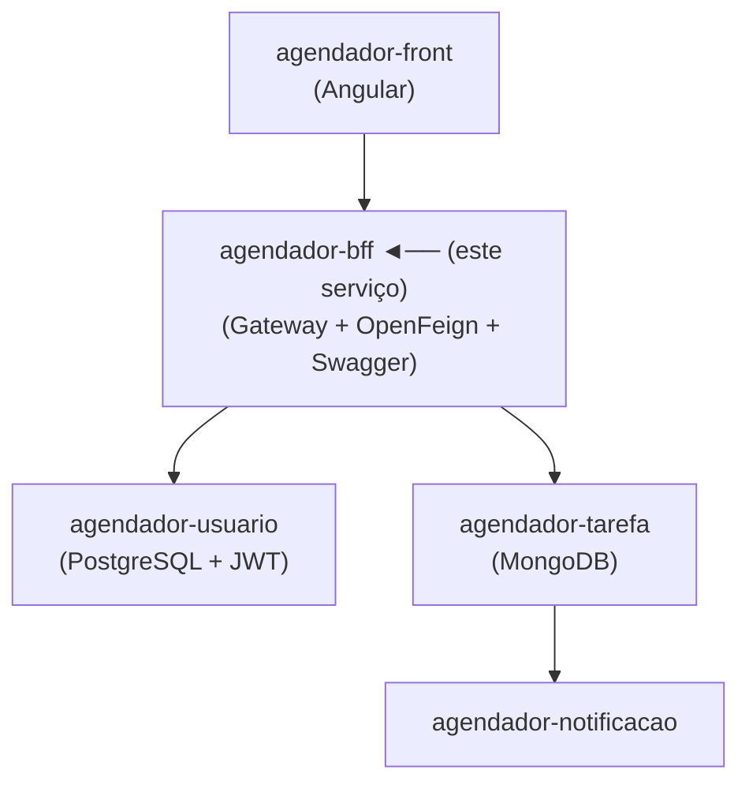
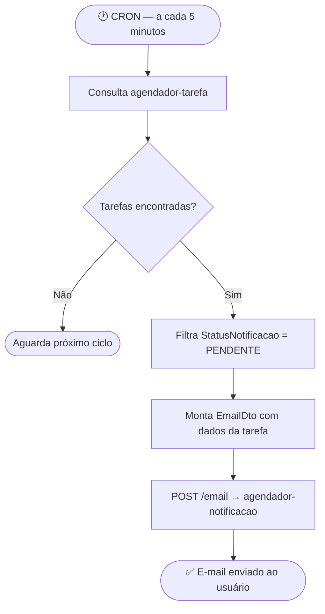

# 🔀 Agendador — BFF (Backend for Frontend)

> Gateway do ecossistema de agendamento. Centraliza o roteamento de requisições, documentação da API, tratamento de erros HTTP e o CRON de notificações.

---

## 📌 Sobre o Projeto

O BFF (Backend for Frontend) atua como ponto de entrada único para o frontend. Em vez de o cliente chamar cada microsserviço diretamente, todas as requisições passam por este serviço, que roteia e trata os dados antes de retorná-los.

---

## 🏗️ Arquitetura do Ecossistema



### Fluxo do CRON de notificações



---

## 🚀 Tecnologias

| Tecnologia | Finalidade |
|---|---|
| Java / Spring Boot | Base do serviço |
| OpenFeign | Comunicação declarativa com microsserviços |
| SpringDoc / Swagger UI | Documentação dos endpoints |
| Spring Web | Exposição da API para o frontend |
| CRON | Envio automático de email para o usuário |

---

## ⚙️ Funcionalidades

- Roteamento de requisições para os microsserviços correspondentes
- Comunicação com `agendador-usuario`, `agendador-tarefa` e `agendador-notificacao` via OpenFeign
- CRON executado a cada 5 minutos para detecção de tarefas próximas do vencimento
- Disparo automático de e-mail via endpoint do `agendador-notificacao`
- Tratamento centralizado de erros HTTP (4xx, 5xx)
- Documentação interativa via Swagger UI

---

## 📖 Documentação

Com a aplicação em execução, acesse:

```
http://localhost:8083/swagger-ui.html
```

---

## 🔧 Como Executar

**Opção 1 — Ecossistema completo via agendador-hub (recomendado)**

```bash
git clone https://github.com/AndreLuizDSM/agendador-hub.git
cd agendador-hub
docker-compose up
```

**Opção 2 — Ambiente de desenvolvimento local (docker-compose do BFF)**

Este repositório possui um `docker-compose.yml` próprio que sobe todos os serviços do backend e builda o frontend localmente a partir do código fonte.

> ⚠️ Para esta opção, o frontend Angular precisa estar clonado em `../../../Projetos-JavaScript/Angular/agendador-de-tarefas` em relação à pasta do BFF — ajuste o `context` no `docker-compose.yml` conforme sua estrutura de pastas.

```bash
docker-compose up --build
```

Os serviços sobem nas seguintes portas:

| Serviço | Porta |
|---|---|
| agendador-front | `4200` |
| bff-agendador-de-tarefas | `8083` |
| agendador-usuario | `8080` |
| agendador-tarefas | `8081` |
| agendador-notificacao | `8082` |
| PostgreSQL | `5433` |
| MongoDB | `27017` |
```

### Rodando a aplicação

```bash
./mvnw spring-boot:run
```

---

## 📂 Outros Serviços do Ecossistema

| Serviço | Descrição |
|---|---|
| [agendador-usuario](../agendador-usuario) | CRUD de usuários com autenticação JWT |
| [agendador-tarefa](../agendador-tarefa) | CRUD de tarefas com MongoDB |
| [agendador-notificacao](../agendador-notificacao) | Notificações por e-mail via Gmail API |
| [agendador-front](../agendador-front) | Interface Angular |

---
