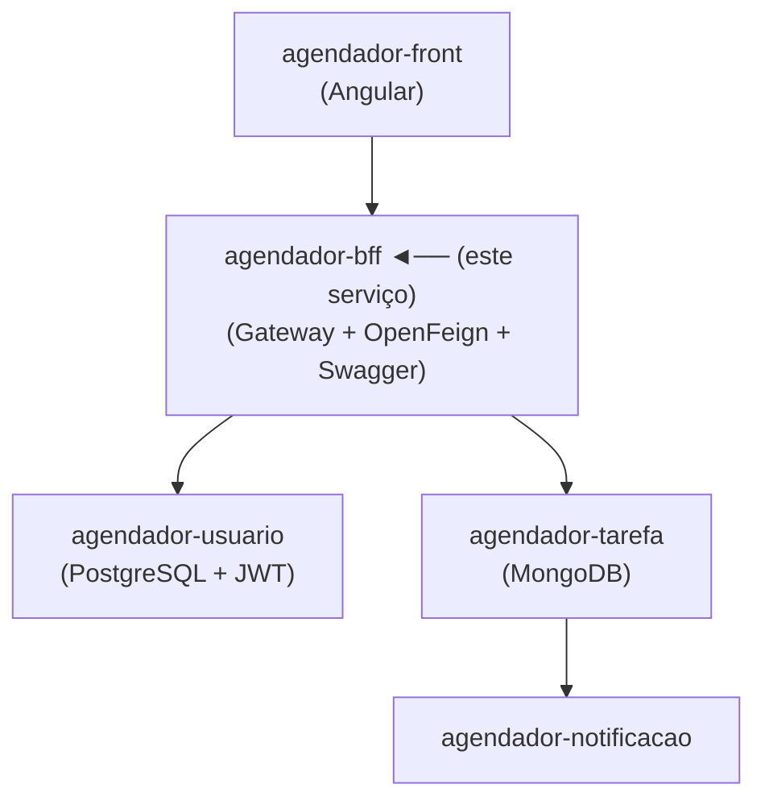

# 🔀 Agendador — BFF (Backend for Frontend)

> Camada de gateway do ecossistema de agendamento. Centraliza o roteamento de requisições, documentação da API e tratamento de erros HTTP.

---

## 📌 Sobre o Projeto

O BFF (Backend for Frontend) atua como ponto de entrada único para o frontend Angular. Em vez de o cliente chamar cada microsserviço diretamente, todas as requisições passam por este serviço, que roteia, agrega e trata os dados antes de retorná-los.

---

## 🏗️ Arquitetura do Ecossistema



---

## 🚀 Tecnologias

| Tecnologia | Finalidade |
|---|---|
| Java / Spring Boot | Base do serviço |
| OpenFeign | Comunicação declarativa com microsserviços |
| SpringDoc / Swagger UI | Documentação dos endpoints |
| Spring Web | Exposição da API para o frontend |

---

## ⚙️ Funcionalidades

- [x] Roteamento de requisições para os microsserviços correspondentes
- [x] Comunicação com `agendador-usuario` e `agendador-tarefa` via OpenFeign
- [x] Tratamento centralizado de erros HTTP (4xx, 5xx)
- [x] Documentação interativa via Swagger UI

---

## 📖 Documentação

Com a aplicação em execução, acesse:

```
http://localhost:8080/swagger-ui.html
```

---

## 🔧 Como Executar

### Pré-requisitos
- Java 25
- `agendador-usuario` e `agendador-tarefa` em execução

### Variáveis de Ambiente

```properties
USUARIO_SERVICE_URL=http://localhost:8081
TAREFA_SERVICE_URL=http://localhost:8082
```

### Rodando a aplicação

```bash
./mvnw spring-boot:run
```

---

## 📂 Outros Serviços do Ecossistema

| Serviço | Descrição |
|---|---|
| [agendador-usuario](../agendador-usuario) | CRUD de usuários com autenticação JWT |
| [agendador-tarefa](../agendador-tarefa) | CRUD de tarefas com MongoDB |
| [agendador-notificacao](../agendador-notificacao) | Notificações por e-mail via Gmail API |
| [agendador-front](../agendador-front) | Interface Angular |

---

## 🧠 Decisões Técnicas

**Por que usar BFF em vez de o frontend chamar os serviços diretamente?**
Com um ponto de entrada único: (1) o frontend não precisa conhecer os endereços de cada serviço, (2) o tratamento de erro é centralizado, (3) é possível agregar dados de múltiplos serviços em uma única chamada, e (4) a documentação Swagger fica consolidada em um lugar só.
